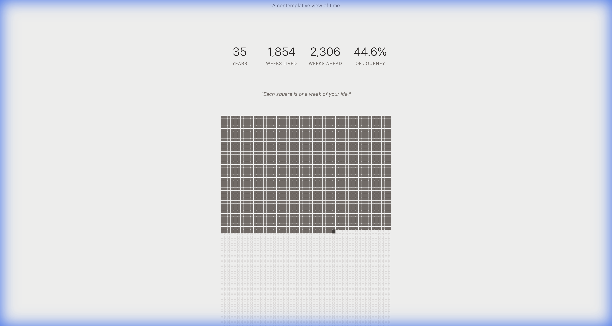

# Life in Weeks — Lifespan Tracker

A contemplative single-page web application that visualizes a human life as weekly blocks. Each square represents one week — a simple, honest view of time spent and time remaining.



## How to Run

```bash
# Install dependencies
npm install

# Start development server
npm run dev

# Build for production
npm run build
```

Then open http://localhost:5173 in your browser.

## Features

- **Visual Grid**: 52 columns × lifespan years of weekly blocks
- **Three States**: Past (filled), current (highlighted), future (outlined)
- **Hover Tooltips**: See the date range for each week
- **Social Export**: Generate a high-resolution PNG (1080×1350) for sharing
- **Data Persistence**: Your data saves locally and loads on return
- **Privacy First**: No accounts, no tracking, data never leaves your device

## Design Philosophy

This is not a productivity tool. It's a reflection artifact.

- Calm, neutral tones (warm off-white, charcoal)
- No gamification or "achievements"
- Emotionally honest, not guilt-tripping
- Designed to be screenshot-worthy

## Technical Stack

- React 18 + Vite
- Pure CSS (no frameworks)
- html2canvas for PNG export
- localStorage for persistence

## Known Limitations

- Export image quality depends on browser html2canvas support
- Very old browsers may have reduced grid performance
- Lifespan is capped at 40-120 years

## Assumptions Made

1. **Weeks**: Exactly 7 days each, starting from birthdate
2. **Current Week**: The first incomplete week is highlighted
3. **Lifespan Default**: 80 years (adjustable 40-120)
4. **Time Zone**: Uses browser's local timezone for date calculations

## License

MIT — Use freely, modify freely, reflect deeply.
